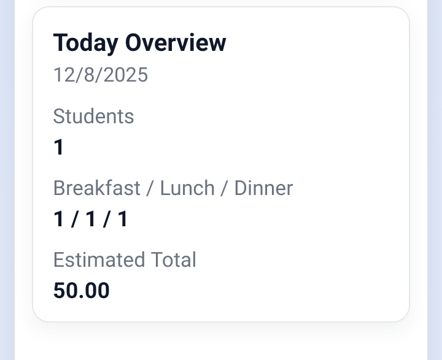
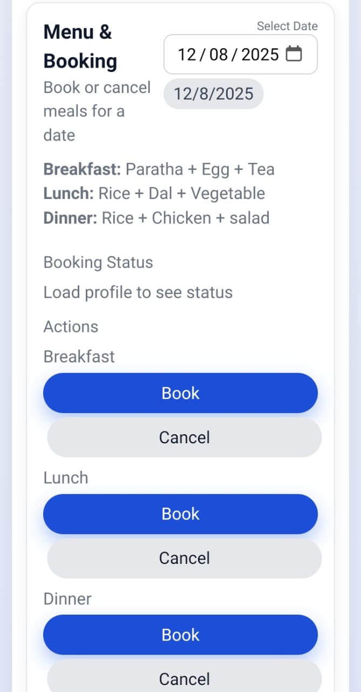
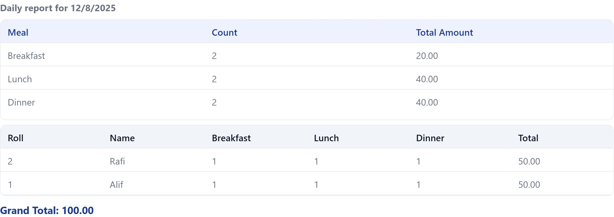

# 🎓 Student Hall Mess Management System

A modern, browser-based system to manage a university hall mess — from daily meal booking to monthly billing — built with **HTML, CSS, and Vanilla JavaScript (ES Modules)** and powered by `localStorage`.

[▶️ Live Demo](https://with-alif.github.io/mess-web/)  

---

## 🚀 Key Highlights

- Single-page app with **Student** and **Admin** panels  
- Clean, responsive UI (works great on desktop & mobile)  
- Fully **offline-capable** – all data stored in the browser  
- Smart **monthly billing** with incremental charging (no double billing)  
- Export **meal reports** as both **PDF** and **JPG**

---

## 🧭 Usage Overview

### 👨‍🎓 Student Panel

- Login with **Roll number**
- View **today’s menu** (Breakfast / Lunch / Dinner)
- Book / cancel today’s meals
- See personal **meal history**
- Check **current balance** in real time

### 🧑‍💼 Admin Panel

- Secure admin login (configured in `admin-auth.js`)
- **Dashboard overview**:
  - Total students
  - Today’s meal counts
  - Estimated cost
- Manage **today’s menu** and **per-meal prices**
- **Student management**:
  - Register, edit, delete students
  - Maintain **Deposit** & **Balance**
  - Add payments (updates `totalDeposits` + `currentBalance`)
- **Monthly billing logic**:
  - Calculates bill from actual meals taken
  - Uses `billedTotals[year-month]` to charge only **new extra amount**
  - Updates `currentBalance` safely (no double billing)
- **Reports**:
  - Daily, Monthly, and Custom Range meal reports
  - Summary + per-student breakdown + Grand Total
  - Export as:
    - 📄 **PDF** (jsPDF)
    - 🖼️ **JPG** (html2canvas via `picture.js`)
- **Backup & Restore**:
  - Export all data to JSON
  - Import JSON backup later

---

## 🖼️ Screenshots

> Folder: `./picture/`

### Dashboard / Overview

### Meal Booking

### Meal Report (PDF / JPG Export)

---

## 🛠 Tech Stack

- **Frontend:** HTML5, CSS3, Vanilla JavaScript (ES Modules)
- **Storage:** `localStorage` (fully offline, no backend)
-